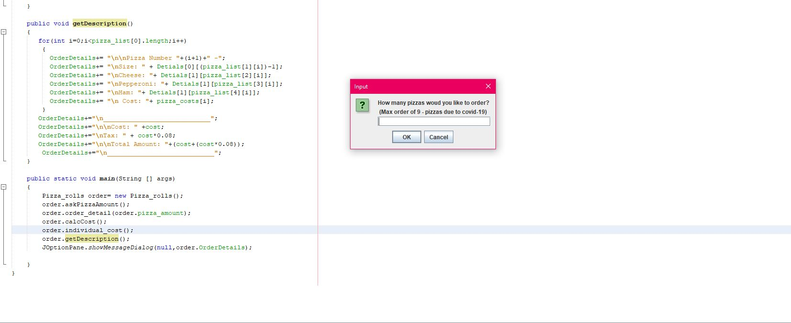
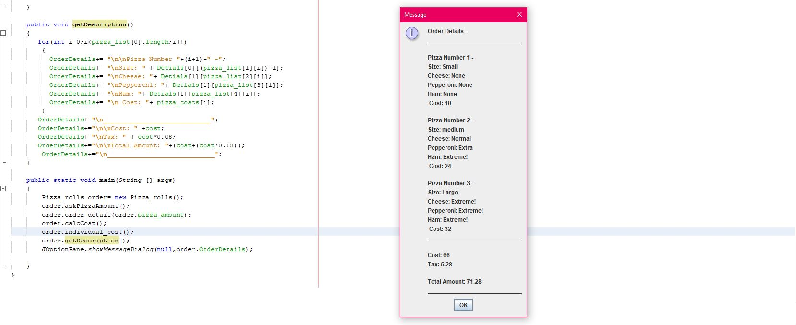

# Pizza Order
This repository will keep replicate an pizza online ordering app.  

## Requirements-
 - Java compatible SDJ
 - Apache NetBeatss IDE 12.0 

## User Input -

We use the JOptionPane UI to get input from the user and obtain how many pizzas to order. We also ask them the details of there pizzas.

## Calculating Total Cost

We then calculate how the details of the pizza and return the total cost of each pizza. Then we calculate the total and charge a sales tax. Notice that the message is formatted like a receipt.
